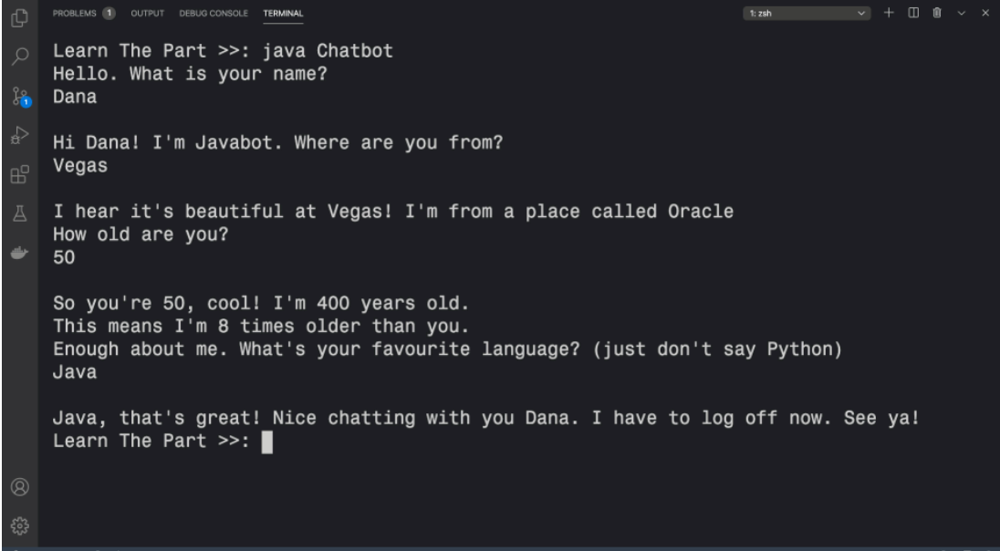
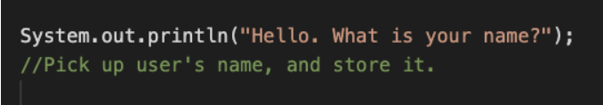

# Java_Chatbot
A chatbot is an application that talks to the user. We're going to build an app that carries a simple conversation.

## 1. Store each answer.

After each question, add code that picks up the user's answer and stores it.

